CSE 312 HW 1 Report

Ertugrul Kasikci 200104004097

Introduction

This report details the implementation and operation of ”Ertugrul’s Operating System”. The system features include process forking, round-robin scheduling, and handling of keyboard and mouse interrupts. This document covers the methods used to implement these features, as well as the output results from various lifecycle strategies.

1  System Setup

To run the operating system, the command make run must be executed within the di- rectory containing the makefile. The name of the OS in the makefile should match ”Ertugrul’s Operating System”. The resulting mykernel.iso file must be added to a virtual machine via Virtual Box to boot the OS. Initial setup may result in errors which can be resolved by correctly adding the ISO file to Virtual Box.

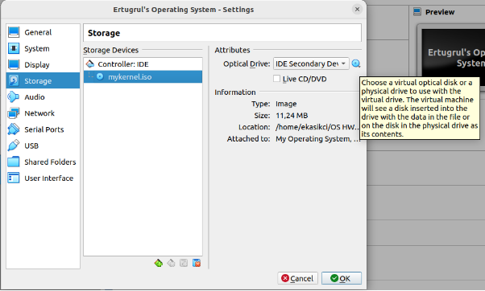

Figure 1: The ISO file is added as shown.

1\.1 Makefile Settings

In order to use Virtual Box, I needed to use VirtualBoxVM keyword that is different from the source code we were provided.

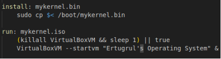

Figure 2: VirtualBoxVM keyword is used.

2  Process Management

The OS implements a custom version of the fork function. Uses round robin scheduling default.

1. Fork Implementation

This function is designed to create a new process and immediately direct it to execute a specific function, identified as entry~~ point. This custom version extends the traditional UNIX fork operation by allowing the new process to begin execution at a predefined point in the program, rather than duplicating the parent process’s execution state.

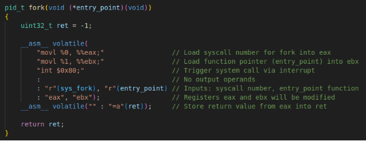

Figure 3: fork implementation.

2. Forking Process of the Functions

Here 6 functions are forked. 4 of them are given in the homework document. I added two idle process to show the CPU switch between processes and my OS’s ability to respond keyboard and mouse interrupts. They have basic while loops that loop infinitely.

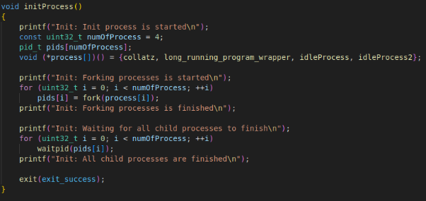

Figure 4: Init process with forking of the functions.

3. long~~ running~~ program Function

In order to pass parameter to long~~ running~~ program, I created a new function called long~~ running~~ program~~ wrapper.

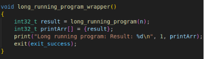

Figure 5: long~~ running~~ program~~ wrapper implementation.

This approach makes it possible to run functions with parameters via fork call. Fork call does not accept functions with returning value and parameters.

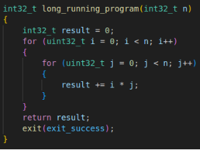

Figure 6: long~~ running~~ program implementation.

3  System Call Implementation

This section explains the implementation of crucial system calls in the OS. These system calls facilitate essential operations such as process creation, execution, waiting, and ter- mination. The functions utilize inline assembly to interact directly with the kernel via software interrupts.

1. fork Implementation

The fork function initiates the creation of a new process. The entry point of the new process is specified by the entry~~ point function pointer. The system call number for fork is loaded into the eax register, and the entry~~ point address is loaded into the ebx register. An interrupt ( int $0x80) is then triggered to execute the syscall.

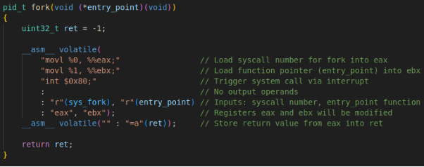

Figure 7: Assembly code for the fork system call.

2. execve Implementation

The execve function executes a new program specified by path. The arguments to the program are passed via argv, and the environment variables are passed via envp. Each of these pointers is loaded into the respective registers (ebx, ecx, edx) before the system call is invoked via an interrupt.

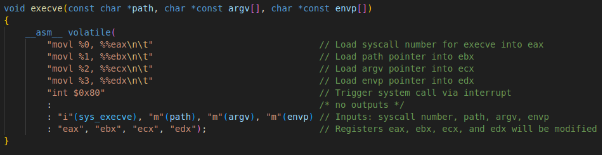

Figure 8: Assembly code for the execve system call.

3. waitpid Implementation

The waitpid function allows a process to wait for another process to terminate. The process ID (pid) is loaded into ebx, and the system call is triggered, with the process status being continually checked until the process terminates.

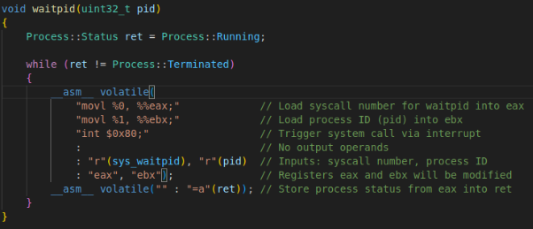

Figure 9: Assembly code for the waitpid system call.

4. exit Implementation

Finally, the exit function terminates a process and exits the program. The exit status is loaded into ebx, and the system call is made to effectively stop the process’s execution.

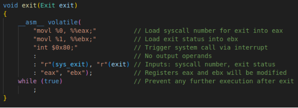

Figure 10: Assembly code for the exit system call.

4  Output Visibility

With the current configuration, the output is not displayed correctly because shortly after the operating system starts, the existing output is replaced by new content. The idle processes continually print output, which contributes to this issue. To view the output correctly, the numOfProcess parameter can be set to 4. This adjustment eliminates the idle functions, allowing the output to remain visible. Below, I will demonstrate the results both with and without the idle functions.

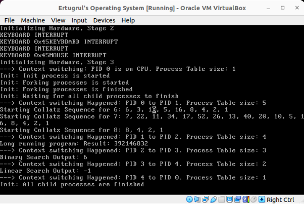

Figure 11: Result without idle funcitons.

In this configuration, all outputs are clearly visible. Only three values for the Collatz function are used here because using more would overcrowd the screen. Once the screen is full, any new output will overwrite the existing content, starting again from the top.

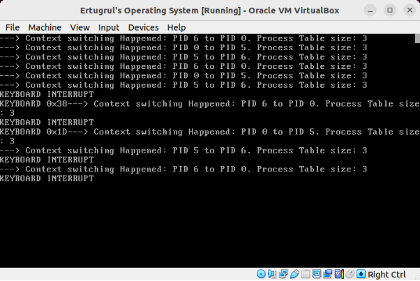

Figure 12: Result with idle funcitons.

With idle functions running, context switching occurs continuously. Despite this, the operating system remains responsive to both keyboard and mouse interrupts. Note that capturing a mouse interrupt screenshot was impractical due to the rapid context switching.

5  Round Robin Scheduling

This section details the implementation of round robins scheduling within the Pro- cessTable.cpp file. The system demonstrates context switching by printing relevant out- puts during operation.

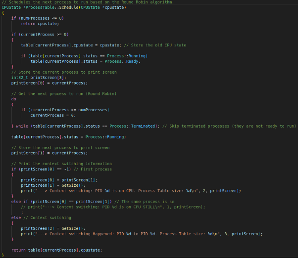

Figure 13: Round Robin Scheduling implementation.

5\.1 Round Robin Scheduling Implementation Details

If numProcess is 0 or less we return cpustate directly. This means we have no other process remaining. Otherwise we store the cpustate inside the current process and set the current process to Ready state from Running state.

The next process which is not Terminated is selected via the do-while loop. The pro- cess table information printed after determining if this process is the same with previous one.

6  Interrupt Handling

This section outlines how the operating system handles keyboard and mouse interrupts, including how these events affect output behaviors.

6\.1 Interrupts Behavior

When an interrupt occurs, the corresponding character is printed to the screen, and the mouse remains responsive as long as the operating system is running. Rather than printing a straightforward message like ”INTERRUPT” upon the occurrence of an inter- rupt, this task is delegated to the interruptAwaitingProcess function. This function is responsible for notifying the user by printing messages, as detailed in Part C of the homework.

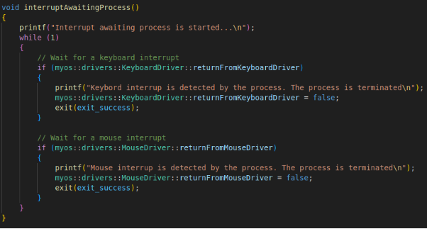

Figure 14: Implementation of interruptAwaitingProcess.

To facilitate communication about interrupt occurrences to interruptAwaitingProcess, I implemented static boolean variables for both keyboard and mouse interrupts.

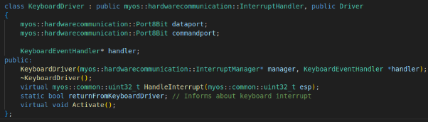

Figure 15: Declaration of returnFromKeyboardDriver.

The returnFromKeyboardDriver variable is set to true when a keyboard interrupt

occurs.

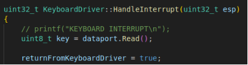

Figure 16: Usage of returnFromKeyboardDriver when a keyboard interrupt occurs. This variable signals to interruptAwaitingProcess that an interrupt has occurred,

and is reset to false within that function after the notification is processed.

Similarly, the variable called returnFromMouseDriver functions in the same manner for mouse interrupts.

7  Lifecycle Scenarios

This section illustrates the operational principles of my operating system through different lifecycle scenarios as described in the homework PDF.

1. Part A Lifecycle

In the Part A lifecycle strategy, each program is loaded three times and initiated. These processes then enter an infinite loop, continuing until all processes have terminated.

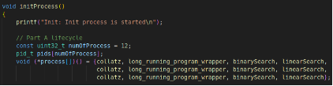

Figure 17: Setting of lifecycle inside the initProcess function.

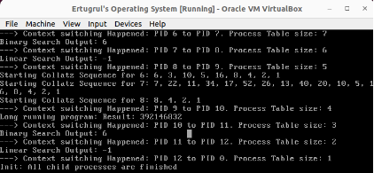

Figure 18: Output from the OS during Part A lifecycle.

2. Part C Random Process Spawning

This strategy utilizes the function interruptAwaitingProcess, which was previously discussed in the Interrupt Handling section. This function operates in an infinite loop, processing keyboard and mouse interrupts by printing notifications and then terminating. This mechanism demonstrates dynamic process handling based on user input.

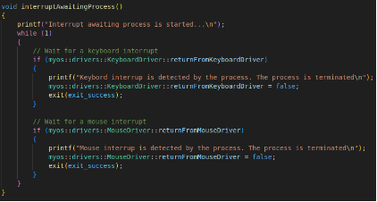

Figure 19: Implementation of interruptAwaitingProcess.

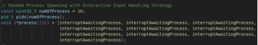

Figure 20: interruptAwaitingProcess loaded 10 times into memory and executed si- multaneously.

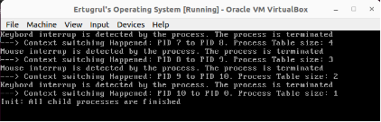

Figure 21: Output from the OS under the Part C lifecycle.
11
